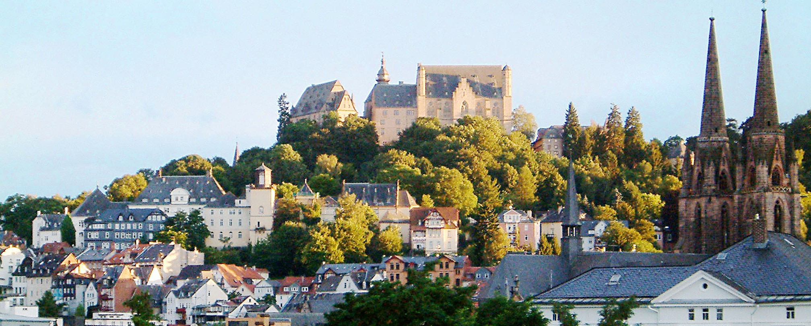

# Hitzeinseleffekt in Marburg
Jonas Müller und Lena Perzlmaier



## Was ist die städtische Wärmeinsel?

Die städtische Wärmeinsel (engl. Urban Heat Island – kurz: UHI) ist das Ergebnis einer Lufttemperaturdifferenz zwischen der wärmeren Stadt und dem kühlerem Umland. Für diese Differenz sind verschiedene Faktoren verantwortlich. Vor allem jedoch der hohe Anteil versiegelter und bebauter Flächen in urbanen Gebieten, aber auch Luftschadstoffe und anthropogene Wärmequellen.

## Berechnung der städtischen Wärmeinsel von Marburg

Diese Differenz wurde  mit Satellitendaten der Oberflächentemperatur[^1] für die Jahre 2000, 2006, 2012 und 2018 berechnet. Dazu wurde noch zusätzlich ein Geodatensatz benötigt, welcher Informationen über die Landnutzung[^2] bereitstellt. In der ersten interaktiven Karte ist das Stadtgebiet von Marburg zu sehen, sowie eine 10 km breite Pufferzone. Für die Berechnung werden folgende Informationen benötigt:

* die städtische Oberflächentemperatur

* die ländliche Oberflächentemperatur

Für die städtische Oberflächentemperatur wurden alle Bereiche innerhalb des Stadtgebiets genutzt, die durch den Landnutzungsdatensatz als bebaute Flächen definiert worden sind. Für die ländliche Oberflächentemperatur wurden alle Bereiche innerhalb der Pufferzone genutzt, die durch den Landnutzungsdatensatz nicht als bebaute Fläche definiert worden sind.

## Ergebnisse

### Vorwort zu den Ergebnissen

Die Ausprägung der städtischen Wärmeinsel kann von Stadt zu Stadt trotz ähnlicher Größe sehr unterschiedlich sein. Das hängt unter anderem von den lokalen klimatischen Bedingungen, der  Topographie und auch der Landnutzung im angrenzenden Umland ab. Dabei gibt es beispielsweise große Unterschiede bei der Oberflächentemperatur zwischen Wäldern und Agrarflächen (siehe dazu[^3]). In Marburg besteht der überwiegende Teil der ländlichen Oberfläche in der näheren Umgebung aus Agrarflächen, besonders in Richtung Osten (Amöneburger Becken). Wenn man daher die Karte zur Oberflächentemperatur betrachtet verwundert es nicht, das diese Gebiete wesentlich wärmer sind als Bereiche mit größeren Waldfächen wie beispielswiese den Lahnbergen. 

**Temperatur und Niederschlag[^4]**

Der Niederschlag nimmt für die Sommer der untersuchten Jahre ab, wobei das Jahr 2018 durch einen besonders trockenen Sommer hervorsticht. Die Temperatur steigt über die Jahre leicht an und erreicht im Sommer 2018 mit ungefähr 20 Grad °C im Mittel den höchsten Wert.

**How-to - Umgang mit interaktiven Karten**

Die hier erstellten und dargebotenen interaktiven Karten für die Untersuchung zur städtischen Wärmeinsel in Marburg bestehen aus fünf Teilkarten (im Folgenden als Layer bezeichnet). Diese sind links oben unterhalb des Minussymbols anwählbar. Der erste Layer ist die Basiskarte "OpenStreetMap.DE". Sie ist immer aktiv und lässt sich nicht deaktivieren. Alle anderen Layer (Stadtgebiet Marburg, die Oberflächentemperatur, die Landnutzung und der Hitzeinseleffekt) sind durch das anklicken des Kästchens aktivierbar und deaktivierbar. Für alle Layer, bis auf das Stadtgebiet Marburgs, wird auf der rechten Seite eine Legende mit Informationen zur jeweiligen Karte angezeigt. Unterhalb der Legenden befinden sich Klickflächen zu den Karten. Beim betätigen jener, wird auf den entsprechenden Layer gezoomt.

### Jahresübergreifende Charaktermerkmale der städtischen Wärmeinsel in Marburg

Die städtische Wärmeinsel in Marburg hat über alle Jahre hinweg sehr ähnliche räumliche Muster. Die stärkste Ausprägung befindet sich zwischen Cappel/Richtsberg und dem Südviertel. Dort kann der Wärmeinseleffekt durchaus 2-3 °C erreichen. In Richtung der Randgebiete der Stadt ist eine deutliche Abschwächung zu erkennen. Die Waldgebiete der Lahnberge, Wehrda und Marbach sind klar zu erkennende Kälteinseln innerhalb des Stadtgebiets. Dort ist die Oberflächentemperatur im Vergleich zum Umland ungefähr 2 °C geringer. 

**Das Ausnahmejahr 2018**

Im Mittel liegt für das Jahr 2018 der schwächste Wärmeinseleffekt vor, trotz eines wärmeren Sommers. Dies liegt daran, dass es in diesem Sommer besonders trocken gewesen ist, sodass sich vor allem die umliegenden Agrarflächen überdurchschnittlich stark erhitzten und die Differenz zu den städtischen Gebieten geringer war, als in den anderen Jahren. Dies verdeutlicht auch eine Schwachstelle bei der Berechnung der städtischen Wärmeinsel mit Satellitendaten, da solche Flächen bei der Berechnung für Marburg stärker ins Gewicht fallen.

### Ausprägung des Hitzeinselffektes in den jeweiligen Jahren {.tabset .tabset-fade}

#### 2000 (UHI von 1.14°C)

#### 2006 (UHI von 1.25°C)

#### 2012 (UHI von 1.09°C)

#### 2018 (UHI von 0.69°C)

## Lösungsstrategien

Was kann getan werden um den Hitzeinseleffekt in Marburg zu reduzieren und was wird schon getan? 

**Grünflächen**

* Grünflächen wirken sich positiv auf das Stadtklima aus. Bäume spenden Schatten und kühlen die Umgebung außerdem durch ihre Verdunstungskälte. Auch Begrünte Dächer geben Verdunstungskälte ab. Außerdem reduzieren sie die Bodenversiegelung, die zum Hitzeinseleffekt beiträgt.

* Um Eigentümer zu motivieren ihre Dächer zu begrünen, hat die Stadt Marburg ein Förderprogramm für Gründächer aufgelegt und bezuschusst bis zu 50% der Kosten einer Begrünungsmaßnahme. Weitere Informationen sind hier zu finden: [Gründach-Zuschuss Stadt Marburg](https://www.marburg.de/leben-in-marburg/umwelt-klima/klimaschutz/foerderprogramme-von-marburg/gruendach-zuschuss/)

* Für einen ersten Eindruck, ob ein Dach für eine Dachbegrünung geeignet ist, hat die Stadt Marburg ein digitales Gründach Kataster in Auftrag gegeben. Das Gründach Kataster gibt Auskunft über die allgemeine Eignung eines Daches zur Begrünung, sowie zu erwartende Kosten und geeigneten Pflanzen. [Hier geht es zum Gründach Kataster](https://www.gpm-webgis-10.de/geoapp/gruendachkataster/marburg/)

**Klimaschutz**

* Klimawandel und Hitzeinseleffekt sind eng miteinander verknüpft. Zum Beispiel werden Extremwetterereignisse, wie Hitzewellen, die durch den Klimawandel häufiger auftreten, durch den Hitzeinseleffekt verstärkt. Deshalb trägt auch Klimaschutz zur Reduzierung des Hitzeinseleffekts bei.

* Die Stadt Marburg hat sich das Ziel gesetzt bis zum Jahr 2030 eine klimaneutrale Stadt zu werden und hat mit dem Klima-Aktionsplan konkrete Maßnahmen zur Erreichung des Ziels entwickelt. Der Klima-Aktionsplan kann hier eingesehen werden: [Klima-Aktionsplan 2030](https://www.marburg.de/downloads/datei/OTAwMDE3MTIzOy07L3d3dy92aHRkb2NzL21hcmJ1cmcvbWFyYnVyZy9tZWRpZW4vZG9rdW1lbnRlLzIwMjBfMDZfMjlfa2xpbWFfYWt0aW9uc3BsYW5fMjAzMF9maW5hbF9mdWVyX2hvbWVwYWdlXy5wZGY%3D)

[^1]: Corine-Land-Cover-Datensatz (https://land.copernicus.eu/pan-european/corine-land-cover)
[^2]: MODIS-Land-Surface-Temperature-Datensatz (https://modis.gsfc.nasa.gov/data/dataprod/mod11.php)
[^3]: (https://wiki.bildungsserver.de/klimawandel/index.php/Landnutzung)
[^4]: DWD-Messstation in Cölbe (ftp://opendata.dwd.de/climate_environment/CDC/observations_germany/climate/hourly/)
